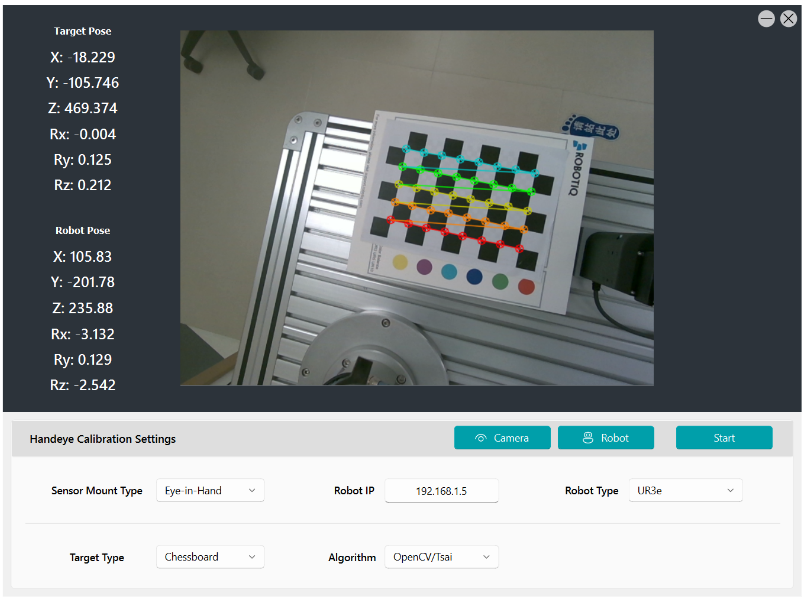

<!--
 * @Author: George Zeng
 * @Date: 2024-07-11 02:53:56
 * @Email: george.zeng@solvay.com
-->
# Handeye Calibration Tool


## Introduction

This tool is used to calibrate the handeye transformation between a robot and a camera.

The HMI is developed based on:
1. [PyQt5](https://www.riverbankcomputing.com/software/pyqt/)
2. [PyQt5-Fluent-Widget](https://github.com/zhiyiYo/PyQt-Fluent-Widgets).

The calibration is based on Tsai's method in [OpenCV](https://docs.opencv.org/4.5.4/d9/d0c/group__calib3d.html#gaebfc1c9f7434196a374c382abf43439b).



## Installation
```
pip install -r requirements.txt
```

## Usage
For users, you can run the following command to start the tool:
```
python main.py
```
The calibration data will be saved as `calibration_result.csv` in the root directory.

## Configuration
You can configure the calibration parameters in the `.env` file.

**Chessboard_x_number**: the number of corners in the x direction of the chessboard.

**Chessboard_y_number**: the number of corners in the y direction of the chessboard.

**Chessboard_cell_size**: the size of the cell in the chessboard (mm).

**Translation_delta**: the translation delta for the robot to move (m).

**Angle_delta**: the rotational delta for the robot to move (degree).

**Calibration_sample**: the number of run for calibration.

**Robot_IP**: the IP address of the robot.

## Calibration Workflow


### Step 1
- Generate the target pose according to the robot's current pose
  - Cal. the euler rotation in specific angle **± delta** angle, **± ½ delta** angle along each axis.
  - Convert euler angles to quaternions then multiply the quaternions to combine rotations.
  - Add delta distance to the translation parts.
  - **Randomly** output a pose from the generated pose list.

### Step 2 
- Check validity
  - Is the pose a singular point?
  - Is the pose repeated?

### Step 3 
- Calculate IK. solution and execute to the target pose
  - Solve inverse kinematics for UR3e using DH parameters to get eight joint angle solutions.
  - Choose the solution with the least total joint movement for execution.
  - If the calibration board is undetected, rollback to the previous position and re-generate new target pose.

### Step 4
- Record homogeneous matrices of the robot and camera in current phase

## Support Robot and Camera
- Robot: 
  - Universal Robot e-series
- Camera: 
  - Intel Realsense D-series

## Future Development Plan
- [x] Add robot type selection (only for Universal Robot now)
- [ ] Optimize the interface to support more robot and camera brands
  - [ ] Doosan
  - [ ] uFactory
  - [ ] Hikivision
- [ ] Add more calibration methods
